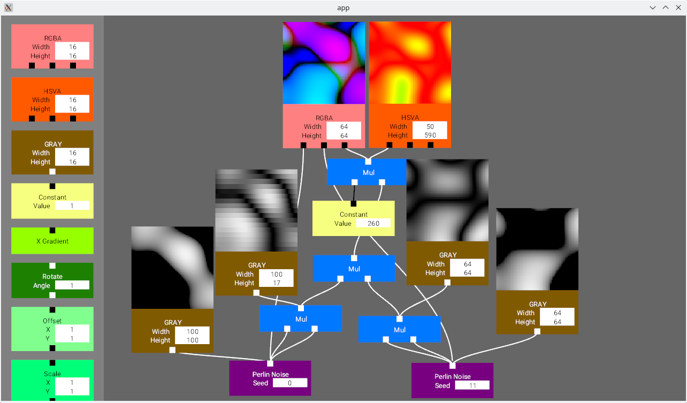

README
===

This project is a tool to generate textures with runtime-parameters in a GUI. It is inspired by the awesome tool ".werkzeug" by the group ".farbrausch".

This project is a small texture generator tool that is build on [Bevy](https://bevyengine.org/) to learn to work with bevy, learn to work with an ECS and make a program with pipeline based data transformation.

